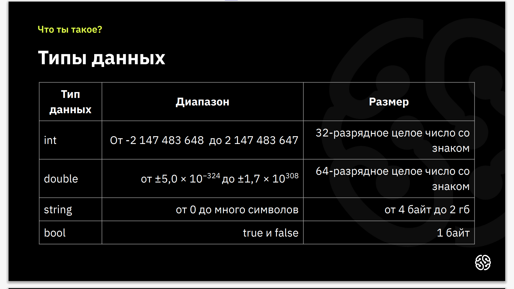

# Lesson#1
Хорошая книга по C# от Джеффри Рихтер\
For work C# нужен **.NET** and expansions (support code) for VSC - **C#**\
Files the **obj** & **bin** better ignore.
([**All files for .gitignore**](https://github.com/iksergey/gitignore/blob/main/VisualStudio.gitignore) (_89% all ignore files_))

### Первые шаги написания программы:

* Получить задачу
* Обдумать условие
* Уточнить условие
* Составить алгоритм
* Уточнить алгоритм
* Исправить алгоритм
* Перепроверить алгоритм
* Начать писать писать код, но это не точно
---
## BEGIN C# 
> Работаем в файле - **Program.cs**

`dotnet new console` => создать новый проект (bush)

`dotnet run` => запустить программу (bush)\
`Console.WriteLine();` => выводит в консоль и переводит на новую строчку\
`Console.Write();` => без перехода on new line\
`Console.ReadLine();` => считать строку из терминала

## Dictionary:
1. **Dictionary** - словарь
